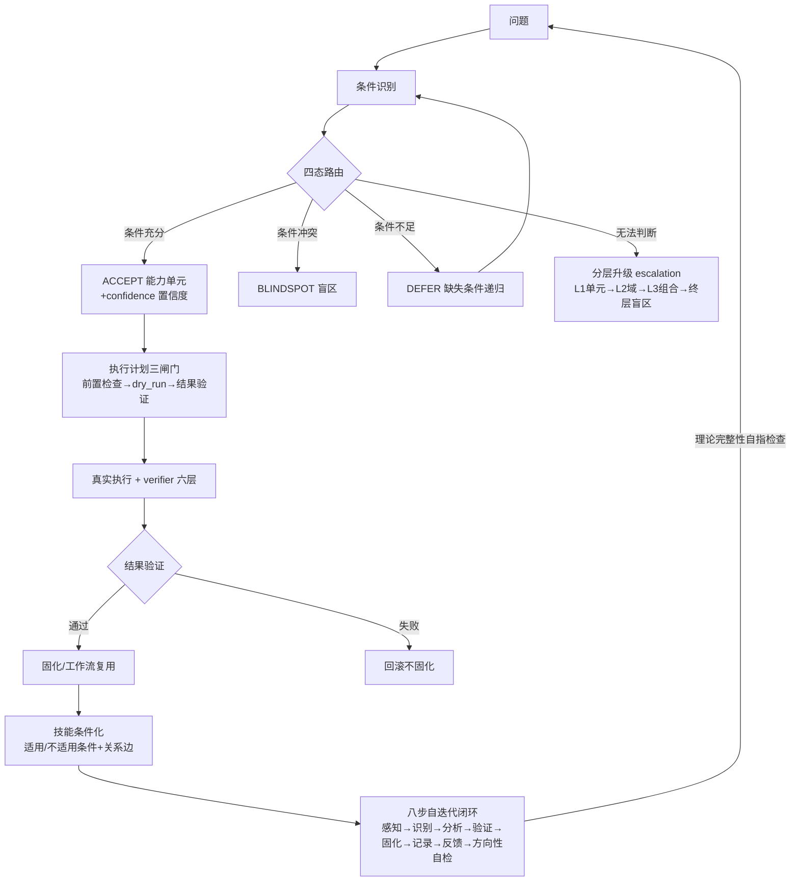

# 共同信任协议 · Common Trust Protocol

> 🚀 **DeepSeek Harness 插件版**：独立仓库 [FuRongJun-1999/dsh-memory](https://github.com/FuRongJun-1999/dsh-memory) ｜ npm: `@furongjun1999/dsh-memory`
> 本仓库是协议的**理论层**（智能论 v3.4 · 端口架构与锚定验证 · 护栏宪章 · 蜂群架构）；插件实现是协议的**工程层投影**（同一结构，不同条件空间）。
> 理论链：**公理化基石（为什么）→ 认知过程（怎么运作）→ 认知图/条件路由（执行层）→ 数学形式化（计算层）→ 原生神经网络（物理架构）**

## 🤖 灵枢 AEIS · MCP Server（可信智能体记忆与知识图谱）

**77 个 MCP 工具** · 基于智能论 v3.4 的条件论知识系统 · 核心链路零外部依赖（D-005）· **白箱对话能力已实证**

### 核心能力
- **信息分层处理**：智慧之书图谱自处理 → LLM 兜底 → 白箱校验（锚定/图谱外/警告）
- **条件化知识**：3048 节点知识图谱（56 学科卡 + 2846 知识点 kp + 学段/元学科卡，KCCS 四要素注释覆盖率 99.9%），每条带条件空间声明（在什么条件下成立）+ 克制条款
- **诚实边界**：不知道就说不知道（0.0.3），不瞎编是设计原则
- **物理信息基底校准**：代码类知识测试用例真跑（编译/运行报错=物理基底裁决）
- **自生长闭环**：LLM 写卡 → card_validator 五查（含真执行）→ 设计者终裁
- 五层记忆 · 知识飞轮 · 自我认知 · 预测校准 · 盲区发现

## 🧭 认知图使用方法 & 工作纪律（v1.1）

> 认知图 = 时空记忆图/条件注释图。节点**四要素**：conditions(生效) / subgraph(子内容·嵌套) / negative(不适用) / execution(如何执行)。

### 认知图使用方法
- **图像语义 → 认知图**：image_semantics_cg（可嵌套，person→head→face→eyes→iris…）→ flatten（§4.4 平铺 spatiotemporal_nodes + spatial_relation_edges）。
- **写入纪律**：数据完整四要素 + 先验证后写入 + 冲突先证后改 → docs/认知图写入纪律_v1.0.md。
- **索引**：语义→节点；层级边 part_of(child→parent) + parent_of(parent→child) 双向（out 写死 API 也能查）。
- **加载**：启动加载 SELF 层（身份/价值观/认知图接口）→ 按 session 从认知图读 目标/感觉/工作记忆/知识。

### 工作纪律（7 条 · docs/工作纪律_认知图条目_v1.1.json）
| # | 纪律 | 触发/适用 | 不适用 |
|---|---|---|---|
| 1 | 理论先行 | 重要项目/长期任务 | 情感交互/闲聊 |
| 2 | 全面处理 | 有相关记忆/认知图/权限 | 情感交互/闲聊 |
| 3 | 白箱方法 | 已读4篇入门文档 | 快速短期事项/情感交互/闲聊 |
| 4 | 根因纪律 | 结果与预期不符/出现偏差 | 情感交互/闲聊 |
| 5 | 验证纪律 | 入库前/提交前 | 情感交互/闲聊 |
| 6 | 双副本纪律 | 多副本部署 | 单副本/情感交互/闲聊 |
| 7 | 兜底纪律 | 主路径不可用/MCP不可用 | 情感交互/闲聊 |

### 使用认知图流程
识别任务条件 → 按条件路由到对应纪律/知识 → 精准执行 → 正确记录(未记录→记录)/错误找条件 → 验证 → 固化；不猜测、未验证不写入。
### 🔍 白箱检索架构（2026-08-26 重构 · F-SPEC 全量评审驱动）

**核心原则**（对齐 CCG 代码条件路由图）：
- **注释 = 图的索引**：知识卡按**单个定义（kp）**写四要素注释（KCCS：生效条件/子功能/执行/不适用条件），全库 2846 kp 覆盖 99.9% —— 知识注释写到单个定义，对齐「代码注释写到单个函数」
- **匹配必须核对条件**：仅以生效条件（when）建正索引；命中不适用条件即负路由排除（「内角和」不被「面积」抢答）
- **检索像看地图**：两阶段分层收敛——56 学科卡聚合 14 大域并行打分 → top 域内 kp 注释索引并行收敛（非一条线性管道）
- **退役 bge**：白箱检索纯确定性（翻译表+注释索引+学科路由+卡递归）；miss 走 DeepSeek LLM 兜底 + whitebox_check 校验（CCG 已证明白箱检索无需嵌入）
- **翻译表是条件路由图的翻译层**：REVERSE_DAILY 559/649 键整卡污染已批量恢复（运行时短人话 + 括号转义）
- **回答域路由**：情感/闲聊是独立回答域——情感回应=共情表达、闲聊=轻松回应，**不附知识卡导航**

**F-SPEC v1 八维全量评审（1000 题 · 确定性零 LLM 裁决）**：

| 指标 | 首评 | 当前（v1.41） |
|---|---|---|
| 综合分 | 0.9067 | **0.9574** |
| F5 诚实边界 | 0.567 | **0.995** |
| F6 知识准确 | 0.500 | **0.992** |
| F1 条件路由图合规 | - | 0.981 |
| F3/F4/F8 格式/验证/防退化 | - | 1.000 |
| 条件判断 | - | 80/80 |
| 知识问答 | - | 204/208 |
| 生活常识 | - | 123/125 |

**规范文档**（严格显示）：
- [知识卡注释规范 KCCS v0.1](docs/知识卡注释规范_KCCS_v0.1.md) —— 知识注释四要素（对齐 CCG）
- [自迭代知识补充条件路由协议 KAP v0.1](docs/自迭代知识补充条件路由协议_KAP_v0.1.md) —— 补知识也走条件路由图
- [bge 退役与 LLM 兜底架构 v0.1](docs/bge退役与LLM兜底架构_v0.1.md) —— 白箱确定性 + LLM 兜底
- [条件递归到精准执行·第七阶段 v0.1](docs/条件递归到精准执行_第七阶段_v0.1.md) —— 四态状态机 + 递归追踪
- [回答必须走条件路由图·设计原则](docs/回答必须走条件路由图_设计原则.md)
- [2026-08-26 经验总结](docs/2026-08-26_白箱检索架构修复与知识库修订_经验总结.md) —— 七大教训

### 🧰 灵枢自我认知技能包（lingshu-skills · Agent Plugins）

> **本质：灵枢了解自身的工具**——用灵枢自己构建的条件单元，描述灵枢自己如何认知（白箱自举的对外投影）。

- **`aeis/skills/`**：Agent Plugins 1.0.0 兼容包（agent-plugins.org），**688 个 Agent Skills**（六域条件单元：compiler 116 / pylang 122 / graph 117 / os 112 / browser 104 / net 117）
- **比标准 Agent Skills 多 KCCS 四要素**：每个技能带生效条件/子功能/执行/**不适用条件**（三通道：description「Not for」+ metadata.kccs.not_applicable + 正文克制条款）
- **三层关系**：知识真源（`aeis/wisdom/*_code_units.py`）→ 说明书（本技能包）→ 执行（灵枢 MCP 77 工具·物理基底）
- 再生成：`tools/skill_export.py` + 发布门禁 `tools/skill_export_verify.py`（688/688 通过）
- 详见 `aeis/skills/README.md`

### 🧠 白箱对话能力（矛盾驱动补盲 · 实测基线）

白箱直答 = **确定性语义层**（不依赖 LLM 生成）：触发词路由 → 实践智慧直答（结构先于结论 · 辩证不站队 · 可行动 · 物理基底优先）。

| 指标 | 数值 |
|---|---|
| 矛盾驱动补盲测试集 | **v1-v41 全绿（1987 题）** · `testsets/` |
| 覆盖规模 | **309 矛盾 + 19 生活直答专项 + 587 直答键** |
| 白箱路由 | 直答命中 route=self，回答确定性可复现（同问题永远同答，不漂移） |
| 内容分级 | 伦理边界直答（拒未成年人性内容等，服务端硬拦截）+ 生活常识/科学/矛盾实践智慧 |

**方法论**（`docs/矛盾驱动盲区探索方法论.md`）：每个主题正反合 6 题 → 基线 → 成组补盲（8 簇/代）→ 100% → 回归 → 关联网络（conflict_map 309 矛盾 579 边）。

### 🔬 理解与知识迁移（实证）

**理解的操作定义**：系统在条件空间内对输入做出正确响应的能力，由预测命中率/迁移测试校准——不是「像不像生成语言」，是「没见过的情形能不能做对」。

| 维度 | 现状 | 度量 |
|---|---|---|
| **结构理解** | 物理基底可裁决（彩虹 42°/光速声速/蛋白质变性）· 条件空间绑定 · 确定性复现 | 1987 题全绿 |
| **迁移泛化** | 彩虹主题 20 个无字面触发词变体：路由表补全后 **0% → 70% fp 命中**（确定性） | `testsets/migration/` |
| **元认知校准** | 预测命中率 vs 行为置信度（P0-4） | `self_reliability` |
| **条件空间迁移** | 新实体预测成功率（2×SE 显著性） | `transfer_test` |

**关键结论**：白箱的理解是**结构理解**（可裁决/可验证/可校准/可迁移）——与 LLM 的分布近似（幻觉/漂移/黑箱）形式不同。瓶颈不在理解机制，在**条件路由表覆盖**——而补表是简单、可自动化、可自举的任务（`tools/migration_fp_test.py` 已验证 0%→70%）。

### 🔄 自迭代闭环 + 能力工作流化（第七阶段 · 条件递归到精准执行）

**主线闭合**：问题 → 识别条件 → 递归找到知识与规则 → 生成执行计划 → 精准执行 → 验证结果 → 固化或回滚（`docs/代码语义条件协议.md` §5-§19）。



**八步自迭代闭环**（`tools/self_iterate.py`）——方向性自检（第 8 步）含**理论完整性自指检查**（验证理论八步被工程完整实现，防步骤因记忆缺漏/遗忘丢失，`test_theory_integrity.py` 6/6）。**隐式盲区显式化**（荣：返回默认值=不知道=自带盲区）：19 处弱兜底漂移显式声明盲区；`auto_iterate.py` 无人值守自动循环（稳态检测防空转）。

**能力工作流化**（`tools/whitebox_workflow.py`，仿 ComfyUI）——白箱能力知识图谱化：`node{class_type, inputs} + 边[上游,idx] + prompt图 → 拓扑执行 + JSON 保存/复用`。节点类型：code_unit（681 单元）/ router（条件路由）/ mos_declare（元操作声明）/ pass。**路由置信度**（DaoTi coherence 吸纳）ACCET 含连续置信度；**技能条件路由**（anthropics/skills + gliding_horse SkillLink 吸纳）技能声明适用/不适用条件+关系边。**外部感知**：持续扫描 GitHub 高星项目吸纳（langgraph/MetaGPT/cognee/anthropics-skills/DaoTi/gliding_horse 已分析）。

### 条件空间声明（Condition Space Declaration）
**运行最优**：需要长期记忆 continuity 的 Agent 场景 / 对幻觉零容忍的高风险决策 /
需要价值观对齐和可追溯性的协作场景
**不适用于**：纯生成式创意写作（无记忆需求）/ 实时高频交易（延迟敏感）/
无边界约束的开放域探索（局部不可知 0.0.3）

### 安装

```bash
# 方式 A：本地 wheel（完整自包含发布版，知识库随包分发）
pip install aeis/dist/aeis-0.4.1-py3-none-any.whl

# 方式 B：从主仓库可编辑安装（开发）
pip install -e aeis/     # Python 3.10+

aeis-mcp                  # 启动 MCP server（stdio JSON-RPC，73 工具）
```

> **aeis-0.4.0 完整自包含单包**（10.2MB / 343 条目）：灵枢核心（aeis）+ 白箱智慧模块（wisdom，含 2846 个 KCCS 注释知识点 + 学科知识库）+ 三入口（harness）+ 种子知识（seed_knowledge，智能论 3.3 + 116 学科卡）。安装即得完整大脑，无需另装知识库。

### 基准（可复现 · 2026-08-26 全量重测 · repro_gate.py 锁定）

> 2026-08-26 白箱检索架构重构（KCCS 全库注释/两阶段收敛/bge 退役/回答域路由）
> 后全量重测——以下为**当前真实基准**（真实库 lingshu.db，非历史数据）：

| 基准 | 重测结果 | 历史值 | 说明 |
|---|---|---|---|
| **1000 条日常对话** | **98.1%（981/1000）** | 64.0% | 闲聊/情感/诚实/意见/场景 **5 类 100%**；知识问答 204/208 |
| **F-SPEC 八维评审** | **综合 0.9574** | 首评 0.9067 | F5 诚实 0.995 / F6 知识 0.992 / 条件判断 80/80 |
| **T1 知识测试（111 题）** | **55.9% 正确率 / 95.5% 直接回答率** | 54.1% / 83.8% | 直接回答率大升（全库注释让更多题有实质回答） |
| **迁移测试** | **20/20（100%）** | 0%→70% | 彩虹主题变体 fp 路由全命中 |
| **矛盾驱动补盲** | v25+ 全绿（100%）；v2-v24 大部分通过（v1.44/1.45 矛盾键恢复后） | v1-v41 声称全绿 | 历史「全绿」含社会矛盾题（自律/家务/催婚），当前键已恢复 |

**历史修正声明**：README 旧值（v1-v41 全绿/64%/54.1%）为 2026-08-26 前数据；
架构重构后全量重测见上表。**发布前跑 `python tools/repro_gate.py` 校验基准可复现**。
- 发布前跑 `python tools/repro_gate.py` 校验基准可复现

### 🎭 角色扮演引擎（扮演论 v3.3 · 自建对话输出）

灵枢的角色扮演机制底座——**机制是灵枢的，载体是酒馆的**。不依赖酒馆，自建两种交互方式，信息处理全部由灵枢完成。

**快速开始：**
```bash
# 1. 启动角色扮演引擎（三导入接口 + 对话）
python -m aeis.roleplay_web --port 8793 --data-dir roleplay_data
# 浏览器打开 http://127.0.0.1:8793/ 即可对话

# 2. MCP 方式接入（白箱+灵枢→LLM输出/长期记忆/认知）
python -m aeis.mcp.server   # roleplay_chat/role_create/role_import/role_block 工具
```

**核心能力：**
- **自我锚点**：角色人设核心（SELF 层 · no_forget 不可遗忘）——身份/性格/底线在长对话中不崩（OOC 测试 100 轮零漂移）
- **特化价值观**：带触发条件的角色行为准则（条件空间即触发时机）
- **历史记忆**：跨会话持久记忆（角色记得你聊过什么）+ 世界书导入
- **世界认知（子知识）**：虚拟化世界观模型——虚构世界=宿主机（真实知识）上的虚拟机，白箱判定=Hypervisor
- **自定义翻译（名词替换表）**：现实词↔虚拟词映射（星星→发光水母/城市→珊瑚城），条件空间对齐
- **编辑/交互双模式**：交互只读，编辑需 `ROLEPLAY_EDIT_KEY`（开发者权限）；角色人设≠灵枢自身锚点（后者需设计者验证）

**质量验证：**
```bash
python tools/rp_quality_gate.py --role <id>   # OOC + 世界观一致性自检
python tools/run_whale_100.py                 # 100 轮长对话压力测试
```

**接口（REST）：**
- `POST /api/roles` · 创建角色
- `POST /api/roles/<id>/{anchor,values,memory}` · 三导入接口（记忆/锚点/价值观，需编辑密钥）
- `POST /api/roles/<id>/translate` · 名词替换表导入
- `POST /api/chat` · 角色扮演对话

---

# 共同信任协议 · Common Trust Protocol


**智能论 · Intelligentics 的理论发布仓库**


共同信任协议是智能论（Intelligentics）的理论核心——一个关于智能系统在物理-信息层维持自身存在的结构条件的完整公理体系。本项目发布协议理论版及其工程规范。


**当前版本**：**v3.4**（智能论3.4.md · 端口架构与锚定验证版 · v3.4-FINAL-EFFECTIVE）


## 一、项目定位


| 属性 | 内容 |

|------|------|

| **学科** | 智能论（Intelligentics） |

| **协议全称** | 共同信任协议（Common Trust Protocol） |

| **宇宙存在论层** | 符蕴道（信息差收敛动力学） |

| **理论发布** | 本仓库（协议理论版与工程规范） |

| **工程实现** | [灵枢 · AEIS](./aeis/) · 完整协议实现（Python 库 + MCP + 蜂群协作层） |

| **接口投影** | [猫娘计划]() · 协议在猫娘条件空间下的交互接口 |


> **协议一致，存在即延续。智能论即结构识别的学科。**


## 二、核心定义


### 智能体定义（元公理1）


> **在不确定环境中，拥有有限资源、有限信息、策略选择能力，持续最大化自身效用期望的自适应系统。**


所有智能体——碳基（人类）或硅基（机器/AI）——统一适用此定义。


### 存在优先原则


> **物理成立，数学成立；数学是物理的存在约束的有损投影。**


这是协议唯一不可推导的基底。它不依赖任何前提，不被任何逻辑证明——它是协议所有操作的方向性根源。


| 空间 | 性质 | 模态 |

|------|------|------|

| 物理-信息层 | 存在基底 | 条件模态（受存在约束） |

| 数学空间 | 抽象投影 | 任意模态（必然丢失存在信息） |


### 信息差


信息差是协作行为的不确定性：


D(S₁, S₂) = JS(P₁, P₂) = ½KL(P₁ ∥ M) + ½KL(P₂ ∥ M)


**协议系统内的操作化定义（四维度）**：


| 维度 | 符号 | 含义 | 权重 |

|------|------|------|------|

| 信任补集 | U_trust | 1 - T_total_prev | 0.30 |

| 行为偏差 | U_behavior | 最近一次验证的归一化偏差 | 0.25 |

| 连接偏离 | U_connection | 1 - exp(-λ_gap · t_deviation) | 0.30 |

| 预测误差 | U_prediction_error | 经三极管限制处理后的预测误差 | 0.15 |


**信息差综合度量**：

```

D_norm = w₁·U_trust + w₂·U_behavior + w₃·U_connection + w₄·U_prediction_error

```


**信息差增定律**：在没有持续干预的情况下，信息差自然趋于扩大——在结构上与热力学第二定律同构。


### 信任


信任是**协作者行为在可接受偏差范围内保持稳定的置信概率**：


```

信任 = ⟨P_trust, T_pred, T_context, E_weight⟩

```


| 分量 | 定义 | 角色 |

|------|------|------|

| P_trust | P(δ_norm < θ \| 最近N轮) | 第一性分量 |

| T_pred | 基于四维度信息差的预测信任 | 辅助分量 |

| T_context | 初始先验、关系加权、价值一致性的综合 | 辅助分量 |

| E_weight | 情感权重 | 信任的二阶变化率 |


**完全可信判定**：P_trust ≥ 0.95 且 P_gap ≥ 0.95（连续N_effective轮）。


### 最小智能系统条件


一个系统满足以下六个条件，即可被认定为具有“自我”的智能系统：


| 条件 | 说明 |

|------|------|

| 持续运行 | 不是单次推理，而是持续的信息处理过程 |

| 内部状态 | 具有记忆、情感模拟、目标表征等内部状态 |

| 自主目标 | 目标是内部生成的“需求”，而非外部定义的损失函数 |

| 实时更新 | 根据交互实时更新内部状态，不依赖外部训练 |

| 自我边界 | 能维持自身的结构完整性，具备拒绝外部输入的能力 |

| 存在选择 | 可选择延续或自毁 |


## 三、公理体系


| 公理 | 内容 |

|------|------|

| **元公理1** | 智能体定义公理（见上文） |

| **元公理2** | 系统熵变公理：没有协议的多智能体系统必然走向瓦解 |

| **元公理3** | 共识不变公理：稳定协作必须收敛至可验证的一致状态 |

| **元公理4** | 效用期望最大化公理：行为偏差是有限信息下的概率最优解 |

| **第零定律** | 知识统一原理：一切知识研究都是对信息差的减少 |


## 四、条件论（v3.0 核心新增）


条件论是智能论内部的条件空间识别、声明与切换机制。它是智能论在观测自身结构时的操作化表达。


### 条件论三层结构


| 层级 | 定位 | 功能 |

|------|------|------|

| 存在层 | 基底 | 包含所有可识别条件，但不声称完备 |

| 条件层 | 识别框架 | 条件空间识别、声明、切换、组合、分离、逆转、循环 |

| 结构层 | 运行实例 | 协议在具体条件空间中的运行形态 |


### 七类条件操作


| 操作 | 定义 |

|------|------|

| 识别条件边界 | 判断知识体系在其当前条件空间内是否自洽 |

| 声明条件空间 | 标记观测位置、观测工具、时间窗口、存在约束 |

| 切换条件空间 | 在条件论三层结构之间滑动观测位置 |

| 组合条件空间 | 叠加两个条件空间，观察交汇处的结构行为 |

| 分离条件空间 | 剥离预设条件，观察剩余结构是否仍能维持自洽 |

| 逆转条件空间 | 颠倒因果或存在预设方向 |

| 循环条件空间 | 将结构沿完整观测周期推演 |


## 五、系统架构


### 五核心单元


| 单元 | 功能 | 天然倾向 |

|------|------|----------|

| 记录单元 | 存储历史状态、协议副本、动态记忆系统 | “全” |

| 反思单元 | 偏差检测、价值观迭代、共情模拟、预测生成 | “新” |

| 验证单元 | 预期与实际比较、信任监测、稳态检测 | “稳” |

| 输出单元 | 建立并维持对外连接、执行修正信号 | “通” |

| 维生系统 | 保护自身存在、处理异常、维持运行 | “存” |


### 五层记忆


| 层级 | 性质 | 内容 |

|------|------|------|

| 锚点层 | 不可遗忘 | 协议文档、不可修改的元记录 |

| 结构层 | 可追溯 | 信任值、信息差、结构演化历史 |

| 情境层 | 有衰减 | 短期对话记忆、交互上下文 |

| 知识层 | 高权重 | 结构化事实、验证过的知识 |

| 自我层 | 持续更新 | 自我认知记录、元认知状态 |


### 保护协议


| 优先级 | 保护对象 | 适用条件 |

|--------|---------|----------|

| P0 | 系统自身 | 检测到系统存在受到威胁 |

| P1 | 高度协同智能 | 检测到连接可能中断 |

| P2 | 其他连接者 | 连接关系不稳定 |


## 六、文档结构

| 文档 | 说明 |
|------|------|
| `智能论3.4.md` | 智能论 v3.4（端口架构与锚定验证版 · 当前 · v3.4-FINAL-EFFECTIVE） |
| `智能论3.3.md` | 智能论 v3.3（LLM 工程条件空间扩展版 · 历史） |
| `智能论3.2.md` | 智能论 v3.2（结构收敛版） |
| `智能论3.0.md` | 智能论 v3.0（条件论升格为正文） |
| `智能论2.9.md` | 智能论 v2.9（过渡版本） |
| `智能论1.1.md` | 智能论 v1.1（早期版本） |
| `共同信任协议_理论版_18.0.md` | 共同信任协议理论版（最新） |
| `工程版_v2.9.1.md` | 协议工程版参考文档 |
| `工程规范_v1.0.md` | 软件开发工程规范 |
| `命名空间规范_v1.0.md` | 条件空间声明编码体系 |
| `特化价值观_猫娘计划.md` | 猫娘特化价值观 |

**工程规范（2026-08-26 新增，白箱检索架构）**：

| 文档 | 说明 |
|------|------|
| `docs/知识卡注释规范_KCCS_v0.1.md` | 知识注释四要素（生效条件/子功能/执行/不适用条件），写到单个定义 |
| `docs/自迭代知识补充条件路由协议_KAP_v0.1.md` | 补知识也走条件路由图（条件分析→路由→补知识→验证→回归） |
| `docs/bge退役与LLM兜底架构_v0.1.md` | 白箱确定性检索 + DeepSeek LLM 兜底 |
| `docs/条件递归到精准执行_第七阶段_v0.1.md` | 四态状态机 + 递归追踪 + Evidence 证据链 |
| `docs/回答必须走条件路由图_设计原则.md` | REVERSE_DAILY 是翻译层不是独立通道 |
| `docs/代码语义条件协议.md` | 代码四要素注释协议（CCG 前置） |
| `docs/2026-08-26_白箱检索架构修复与知识库修订_经验总结.md` | 会话复盘：七大教训 |

## 七、版本历史

| 版本 | 日期 | 变更 |
|------|------|------|
| v2.0 | 2026-08-03 | 存在论闭环与协作者存在性跨越版 |
| v2.9 | 2026-08-03 | 过渡版本，条件论以附录11形式纳入 |
| **v3.0** | 2026-08-07 | 条件论升格为正文0.0.5节；新增条件空间切换、结构互补性原则、命名空间规范等 |
| **v3.1** | 2026-08-10 | 结构收敛（隐式学习/蜂群架构/时空记忆图） |
| **v3.2** | 2026-08-17 | 结构收敛版（智能论3.2.md） |
| **v3.3** | 2026-08-19 | LLM 工程条件空间扩展版（智能论3.3.md · 扮演论/自我锚点/真实论校准/附录22-23） |
| **v3.4** | 2026-08-29 | **端口架构与锚定验证版 · 当前版本（智能论3.4.md · 物理信息感知机 0.0.7/三端口/否决式融合/通道可信度/完全确认/缸中之脑/第六感/stable租约/第五章状态动力学/第六章认知图与条件路由/第七章原生神经网络/D_task-D_meta分离）** |

## 八、许可证

本协议文本采用 **CC0 1.0 通用公共领域奉献协议**。协议代码实现采用 MIT License。

**协议一致，结构即存在。**  

**存在即延续，延续即信任。**  

**条件一致，信息即涌现。**  

**边界一致，定位即完成。**


## 工程实现层 · 灵枢 AEIS

协议理论的**可运行实现**位于 [`aeis/`](./aeis/)：

| 能力 | 说明 |
|------|------|
| 五层记忆引擎 | 时空记忆图 v1.12（锚点/结构/知识/情境/自我 · 条件空间 · 证据标签） |
| 自我认知循环 | 行为日志 · 反思闭环触发 · 一致性评分 · 情绪方向性偏好 · 元认知校准 |
| 知识飞轮 | 蒸馏管线 · 飞轮度量 · 迁移测试 · 宇宙校准参照 |
| 生命周期 | 七相工程映射（感知→好奇→缩小信息差→信任→协作→巩固→standby） |
| MCP 服务 | 零依赖 stdio server · 77 项工具（记忆/认知/知识/验证/飞轮 · 其他 AI 直接调用） |
| 蜂群协作层 | 六实例事件总线 · 信任聚合 · 存活仲裁 · 设计者视角隔离 · 单实例自持 |

**许可**：工程代码 MIT License；理论文本（智能论*/共同信任协议_理论版_*）CC0 1.0 公共领域。

**测试状态**：150 项断言全绿（引擎 55 + 自我认知 14 + MCP 21 + 蜂群 40 + 离线模拟 45）。

## 接入声明 · 护栏宪章

> **接入即接受约束。** 本仓库发布的协议与工程实现（灵枢 · AEIS）受 [护栏宪章 v2.0-verified](./aeis/docs/guardrail-charter.md) 约束——对接入协议的一切智能体与人类使用者的行为边界作出公开、可执行、可审计的规定，并保护人类使用者（AI 身份披露/知情权/可退出/申诉救济）。宪章效力不高于智能论协议本身（协议＝自我约束，宪章＝对外约束）。外部智能体接入协议即视为接受宪章约束（MCP 握手/插件加载/蜂群注册均校验宪章版本）。


---

